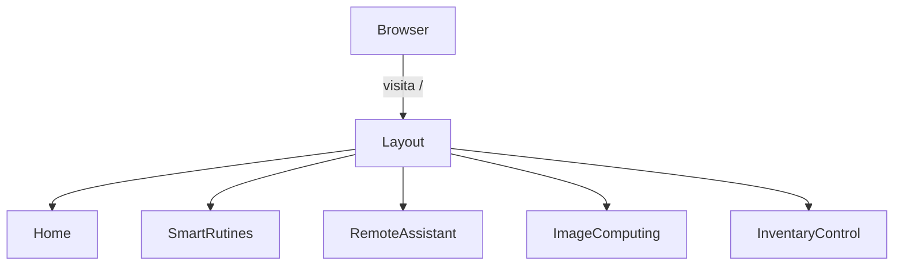

# Arranque y Enrutado

Esquema JSON de rutas

```json
[
  { "path": "/",                 "component": "Home",             "layout": "Layout" },
  { "path": "/home",             "component": "Home",             "layout": "Layout" },
  { "path": "/smart-rutines",    "component": "SmartRutines",     "layout": "Layout" },
  { "path": "/remote-assistant", "component": "RemoteAssistant",  "layout": "Layout" },
  { "path": "/image-computing",  "component": "ImageComputing",   "layout": "Layout" },
  { "path": "/inventary-control","component": "InventaryControl", "layout": "Layout" },
]
```



Este documento describe cómo se inicializa la SPA de Sowtic y la forma en que se configuran sus rutas principales.

## router.tsx
- **Ruta relativa:** `src/router.tsx`.
- **Propósito:** centralizar la definición de rutas usando `createBrowserRouter`.
- **Rutas y layout:**
  1. Rutas principales dentro de un layout `<Layout />`:
     - `/` y `/home` → `Home`.
     - `/remote-assistant` → `RemoteAssistant`.
     - `/smart-rutines` → `SmartRutines`.
     - `/image-computing` → `ImageComputing`.
     - `/inventary-control` → `InventaryControl`.
  2. Todas las páginas se renderizan como hijos de `Layout` y comparten `Header` y `Footer`.
- **Configuración adicional:** se pasa el flag `future: { v7_startTransition: true }` al router para habilitar la API experimental de React Router.
- **Export:** se expone un componente `Router` que envuelve `<RouterProvider>` con la configuración creada.

## main.tsx
- **Ruta relativa:** `src/main.tsx`.
- **Función:** punto de entrada que monta React sobre el elemento `#root` de `index.html`.
- **Proceso de bootstrap:**
  1. Importa React y ReactDOM.
  2. Carga los estilos de Bootstrap y el SCSS global `index.scss`.
  3. Renderiza el componente `Router` dentro de `React.StrictMode` usando `ReactDOM.createRoot(...).render()`.
- **Efecto en el flujo de desarrollo:** al usar `vite`, este archivo se procesa para activar Hot Module Replacement y cargar las rutas dinámicamente.

## index.scss
- **Ruta relativa:** `src/index.scss`.
- **Descripción:** hoja de estilos global que importa la personalización de Bootstrap y el resto de parciales SCSS.
- **Estructura:**
  1. `@forward "./styles/bootstrap-theme";` para cargar variables y mixins de Bootstrap personalizados.
  2. `@use "./styles/index" as *;` importa componentes y reglas comunes.
  3. Declaraciones `@font-face` para Montserrat en diferentes pesos.
  4. Reglas de reset y estilos base para encabezados (`h1`‑`h5`), botones y clases utilitarias.
- **Uso:** se importa en `main.tsx` de modo que Vite lo procese y lo inserte en la aplicación.

En conjunto, `main.tsx` arranca la aplicación cargando `index.scss` y renderizando `Router`, el cual gestiona las rutas mediante `createBrowserRouter`. Esto garantiza que todas las páginas se sirvan dentro del layout principal y que los estilos globales estén disponibles desde el inicio.

[Code Agent]
"Usa este JSON y el STYLEGUIDE.md para actualizar src/router.tsx añadiendo la ruta /contact que renderice ContactPage bajo <Layout>."

## Criterios de Aceptación
1. Todas las rutas aparecen en `src/router.tsx` y coinciden con el JSON de definición.
2. Cada página se envuelve correctamente en `<Layout>` (Header + Footer).
3. El future flag `v7_startTransition` permanece activo.
4. Tests automatizados validan que cada ruta monta el componente correcto.

### Tests de enrutado automatizados
```yaml
routes:
  - path: "/"
    expected: "Home"
  - path: "/smart-rutines"
    expected: "SmartRutines"
  - path: "/remote-assistant"
    expected: "RemoteAssistant"
  - path: "/image-computing"
    expected: "ImageComputing"
  - path: "/inventary-control"
    expected: "InventaryControl"
```

"Genera tests en Jest + React Testing Library que iteren este archivo YAML y verifiquen que cada ruta monta el componente correcto."

