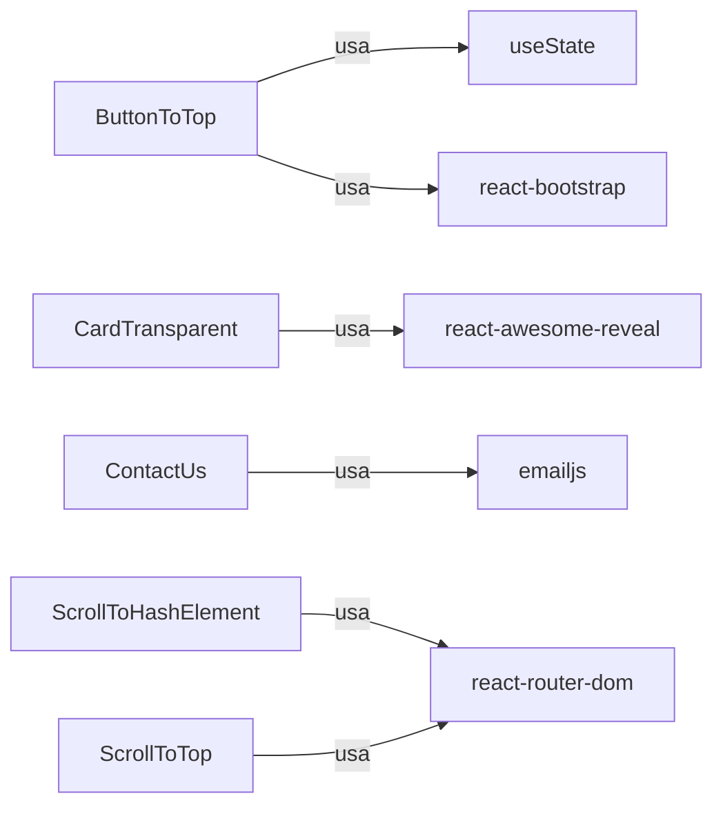

``` json
[
  {
    "name": "ButtonToTop",
    "path": "src/components/shared/ButtonToTop.tsx",
    "selectors": [".btn-back-to-top"],
    "dependencies": ["react-bootstrap"],
    "hooks": ["useState", "useEffect"],
    "examples": ["<ButtonToTop />"]
  },
  {
    "name": "CardTransparent",
    "path": "src/components/shared/CardTransparent.tsx",
    "props": ["children", "textAlign", "itemAlign"],
    "dependencies": ["react-bootstrap", "react-awesome-reveal"],
    "examples": ["<CardTransparent textAlign=\"center\"/>"]
  },
  {
    "name": "ContactUs",
    "path": "src/components/shared/ContatUs.tsx",
    "dependencies": ["react-bootstrap", "@emailjs/browser", "react-google-recaptcha"],
    "examples": ["<ContactUs />"]
  },
  {
    "name": "ScrollToHashElement",
    "path": "src/components/shared/ScrollToHashElement.ts",
    "dependencies": ["react-router-dom"],
    "hooks": ["useLocation", "useMemo", "useEffect"],
    "examples": ["<ScrollToHashElement />"]
  },
  {
    "name": "ScrollToTop",
    "path": "src/components/shared/ScrollToTop.tsx",
    "props": ["children"],
    "dependencies": ["react-router-dom"],
    "hooks": ["useLocation", "useEffect"],
    "examples": ["<ScrollToTop><AppRoutes /></ScrollToTop>"]
  }
]
```



[Code Agent]
"Revisa el JSON de src-components-shared.md y genera actualizaciones en los tests y Storybook para estos componentes, asegurando que cada path existe y que las props están tipadas correctamente en TypeScript."

[Test Agent]
"Crea tests unitarios con React Testing Library que rendericen cada componente del JSON, verifiquen hooks y props, y prueben snapshots en __tests__/shared/ComponentName.spec.tsx."

## Criterios de Aceptación
1. El bloque JSON refleja todos los componentes en `src/components/shared/`.
2. Cada `path` es válido y los archivos existen.
3. Los tests generados cubren al menos render + snapshot para cada componente.
4. Storybook muestra un _story_ por componente con sus props documentadas.
5. Las dependencias externas se importan correctamente y están en `package.json`.
