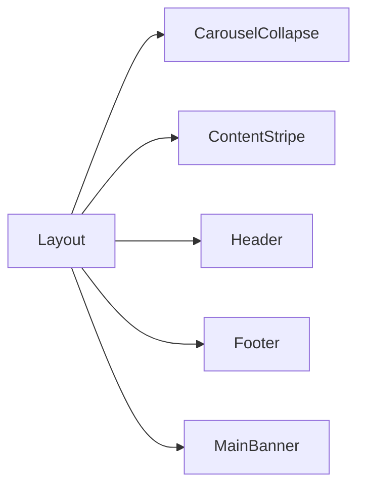

```json
[
  {
    "name": "CarouselCollapse",
    "path": "src/components/CarouselCollapse.tsx",
    "selectors": [".swiper-wrapper", ".swiper-slide"],
    "props": ["dataCollapse?: CardInterface[]"],
    "hooks": ["useState<boolean[]>", "useState<number>"],
    "layouts": ["RemoteAssistant", "SmartRutines", "InventaryControl"],
    "styles": "src/styles/components/_carusel__collapse.scss",
    "notes": ["Breakpoints de Swiper", "responsive"]
  },
  {
    "name": "ContentStripe",
    "path": "src/components/ContentStripe.tsx",
    "selectors": [".software__services"],
    "props": ["image", "title", "text", "buttonText?", "buttonUrl?", "buttonIcon?", "imageRight?"],
    "hooks": [],
    "layouts": ["Home", "RemoteAssistant", "SmartRutines", "ImageComputing", "InventaryControl"],
    "styles": "src/styles/components/_content__stripe.scss",
    "notes": ["animaciones con react-awesome-reveal"]
  },
  {
    "name": "Footer",
    "path": "src/components/Footer.tsx",
    "selectors": ["footer"],
    "props": [],
    "hooks": [],
    "layouts": ["Layout"],
    "styles": "src/styles/components/_footer.scss",
    "notes": ["incluye ButtonToTop", "responsive"]
  },
  {
    "name": "Header",
    "path": "src/components/Header.tsx",
    "selectors": ["nav.header.navbar"],
    "props": [],
    "hooks": ["useState<boolean>"],
    "layouts": ["Layout"],
    "styles": "src/styles/components/_header.scss",
    "notes": ["responsive nav", "toggle en mobile"]
  },
  {
    "name": "MainBanner",
    "path": "src/components/MainBanner.tsx",
    "selectors": [".main__slider"],
    "props": ["buttonBack?", "children"],
    "hooks": [],
    "layouts": ["Home", "RemoteAssistant", "SmartRutines", "ImageComputing", "InventaryControl"],
    "styles": "src/styles/components/_main__banner.scss",
    "notes": ["animaciones con react-awesome-reveal"]
  }
]
```



# Componentes principales en `src/components/`

Esta sección documenta los componentes de alto nivel (excluyendo `shared`) que componen la interfaz. Se ordenan por archivo y se indican props, estado, relación con el layout y notas de estilos.

## CarouselCollapse {#carouselcollapse}
- **Selector**: `.swiper-wrapper` y `.swiper-slide`
  *Ver `ui-selectors.md` sección "Estructura de Swiper – `.swiper-wrapper` y `.swiper-slide`" para detalles de DOM y comportamiento.*
- **Ruta:** `src/components/CarouselCollapse.tsx` y estilos en `src/styles/components/_carusel__collapse.scss`.
- **Relación con la UI:** carrusel que muestra tarjetas con un detalle colapsable; suele ubicarse en secciones informativas como "qué resolvemos".
- **Props:**
  ```ts
  interface CarouselCollapseProps {
    dataCollapse?: CardInterface[];
  }
  ```
- **Estado y hooks:** usa `useState<boolean[]>` para controlar la tarjeta abierta y `useState<number>` para llevar el índice de la última tarjeta activa.
- **Orquestación:** se utiliza dentro de páginas como `Home` para mostrar contenido dinámico. No se integra con el router, pero sí dentro del layout principal.
- **Estilos y breakpoints:** el SCSS define clases como `.what__solve` y ajusta la altura del carrusel. Se utilizan `breakpoints` de Swiper y reglas `@media` para definir cuántas tarjetas se ven según el ancho de pantalla.

## ContentStripe {#contentstripe}
- **Selector**: `.software__services`
  *Ver `ui-selectors.md` sección "Servicios de software – `.software__services`" para detalles de DOM y comportamiento.*
- **Ruta:** `src/components/ContentStripe.tsx` con estilos en `src/styles/components/_content__stripe.scss`.
- **Relación con la UI:** franja de contenido con imagen y texto que puede invertirse (`imageRight`). Aparece en distintas secciones explicativas.
- **Props:**
  ```ts
  interface ContentStripeProps {
    image: string;
    title: string;
    text: string;
    buttonText?: string;
    buttonUrl?: string;
    buttonIcon?: string;
    imageRight?: boolean;
  }
  ```
- **Estado y hooks:** no mantiene estado; sólo renderiza según props. Utiliza `react-awesome-reveal` para animar con `<Fade>`.
- **Orquestación:** se incluye dentro de las páginas `Home`, `RemoteAssistant`, etc., como parte del contenido principal.
- **Estilos y responsividad:** la hoja SCSS ajusta la posición de la imagen con `@media (max-width:768px)` para que se coloque primero en pantallas pequeñas (`order` de Bootstrap).

## Footer {#footer}
- **Selector**: `footer`
  *Ver `ui-selectors.md` sección "Pie de página – `footer`" para detalles de DOM y comportamiento.*
- **Ruta:** `src/components/Footer.tsx` con reglas en `src/styles/components/_footer.scss`.
- **Relación con la UI:** pie de página que contiene el formulario de contacto y enlaces.
- **Props:** no recibe props.
- **Estado y hooks:** no maneja estado; renderiza el componente `ContactUs` y el botón flotante `ButtonToTop`.
- **Orquestación:** se renderiza en `Layout.tsx` después del `<Outlet>` de React Router, por lo que aparece en todas las páginas.
- **Estilos y breakpoints:** el SCSS define la imagen de fondo y espacios internos (`padding`). Incluye reglas `@media` para reducir el `padding` en 992px y 768px.

## Header {#header}
- **Selector**: `nav.header.navbar`
  *Ver `ui-selectors.md` sección "Header – `nav.header.navbar`" para detalles de DOM y comportamiento.*
- **Ruta:** `src/components/Header.tsx` con estilos en `src/styles/components/_header.scss`.
- **Relación con la UI:** barra de navegación fija en la parte superior.
- **Props:** no tiene props.
- **Estado y hooks:** `useState<boolean>` para cambiar a fondo sólido al hacer scroll. El efecto se gestiona con un listener `scroll` en `window`.
- **Orquestación:** incluido en `Layout.tsx` antes del `<Outlet>` para envolver todas las páginas. Contiene enlaces `<Link>` a las rutas configuradas en `router.tsx`.
- **Estilos y responsividad:** el SCSS aplica `padding` a la marca y cambia colores cuando la clase `solid-nav` está presente. Con `@media (max-width:991px)` se aplica un fondo blanco al abrir el menú colapsable.

## MainBanner {#mainbanner}
- **Selector**: `.main__slider`
  *Ver `ui-selectors.md` sección "Banner principal – `.main__slider`" para detalles de DOM y comportamiento.*
- **Ruta:** `src/components/MainBanner.tsx` y estilos en `src/styles/components/_main__banner.scss`.
- **Relación con la UI:** banner principal de cada página; admite un botón opcional para volver a la home.
- **Props:**
  ```ts
  interface MainBannerProps {
    buttonBack?: boolean;
    children: React.ReactNode;
  }
  ```
- **Estado y hooks:** no tiene estado propio; solo renderiza el contenido y usa `Fade` para animaciones.
- **Orquestación:** se coloca al inicio de cada página (`Home`, `RemoteAssistant`, etc.) como parte de su estructura.
- **Estilos y breakpoints:** la hoja SCSS controla la altura mínima y posiciona imágenes decorativas con numerosas reglas `@media` (`992px`, `768px`, `576px`, etc.) para ajustar tamaños y posiciones.

## index.ts
- **Ruta:** `src/components/index.ts`.
- **Propósito:** reexportar todos los componentes del directorio para facilitar las importaciones.
- **Orquestación:** no contiene JSX; se utiliza como punto central para importar `{ Header, Footer, ... }` desde otros archivos.

