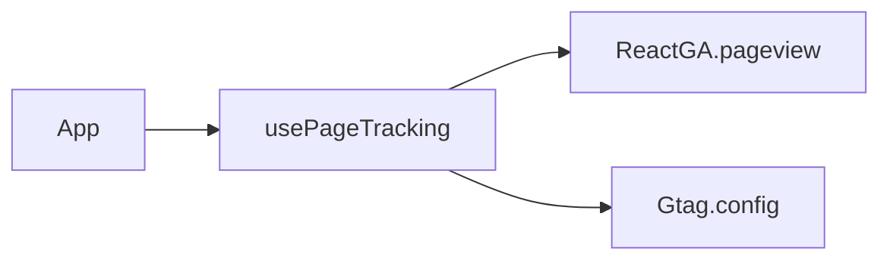

```json
[
  {
    "name": "usePageTracking",
    "path": "src/hooks/usePageTracking.ts",
    "dependencies": ["react-ga", "react-router-dom"],
    "triggers": ["useEffect", "useLocation"],
    "services": ["Google Analytics (GA4)"],
    "notes": ["Envía pageview y evento config gtag"]
  }
]
```


[Code Agent]
"Lee el JSON anterior y refactoriza usePageTracking.ts para:

Extraer la lógica de inicialización en un hook useGAInit().

Añadir manejo de errores si ReactGA.initialize falla.

Mantener los side-effects bajo useEffect con dependencias [pathname, search]."

[Test Agent]
"Genera un test con React Testing Library que:

Monte un componente ficticio usando usePageTracking.

Simule cambios de ruta con MemoryRouter.

Verifique que ReactGA.pageview y window.gtag se llamen correctamente."

## Criterios de Aceptación
1. El JSON refleja todos los hooks en `src/hooks/`.
2. `usePageTracking.ts` existe y exporta el hook con el nombre correcto.
3. El Code Agent puede generar el refactor solicitado y pasa la compilación de TypeScript.
4. El Test Agent produce un test que cubre ambos flujos de GA y gtag.
5. El Doc Agent actualiza la documentación del hook en este archivo tras cualquier cambio.
