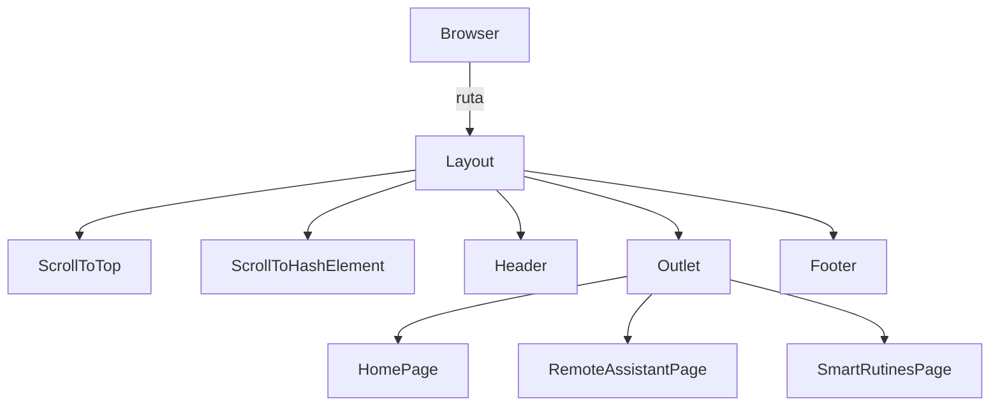

Bloque JSON de definición de layouts

```json
[
  {
    "name": "Layout",
    "path": "src/pages/layouts/Layout.tsx",
    "structure": [
      "ScrollToTop",
      "ScrollToHashElement",
      "Header",
      "Outlet",
      "Footer"
    ],
    "hooks": ["useEffect", "useLocation"],
    "notes": ["No usa context propio", "Encapsula todas las páginas"]
  }
  // …otros layouts si existen
]
```



# Layouts en `src/pages/layouts/`

Esta carpeta aloja los contenedores que envuelven a las distintas páginas. En la estructura actual solo existe un layout principal, utilizado para todas las rutas definidas en `router.tsx`.

## Layout
- **Ruta de archivo:** `src/pages/layouts/Layout.tsx`.
- **Estructura JSX:**
  - Incluye `<ScrollToTop />` y `<ScrollToHashElement />` para gestionar el desplazamiento automático.
  - Muestra el `<Header />` fijo en la parte superior.
  - Renderiza `<Outlet />` donde aparecen las páginas hijas del router.
  - Cierra con `<Footer />`.
- **Hooks de contexto o providers:** no utiliza contextos propios; delega en los componentes importados (`ScrollToTop`, `ScrollToHashElement`) que usan hooks de React Router para detectar cambios de ruta.
- **Uso desde `router.tsx`:** el router crea una ruta raíz con `element: <Layout />` y define sus páginas como elementos hijos. Así, cada sección de la SPA se renderiza dentro de este layout.

[Code Agent]
"Usa el JSON de layouts para refactorizar src/pages/layouts/Layout.tsx y extraer un nuevo hook useScrollManager() que combine ScrollToTop y ScrollToHashElement, respetando las convenciones de STYLEGUIDE.md."

[Test Agent]
"Genera un test con React Testing Library que monte <Layout> usando MemoryRouter en la ruta /remote-assistant y compruebe que Header, Footer y RemoteAssistantPage se renderizan correctamente."

## Criterios de Aceptación
1. El JSON define correctamente el layout y sus componentes internos según el archivo físico.  
2. `src/pages/layouts/Layout.tsx` contiene exactamente las importaciones listadas en `structure`.  
3. El Code Agent puede extraer el hook `useScrollManager` y actualizar el layout sin romper el build.  
4. El Test Agent genera al menos un test que valide la estructura del layout y el renderizado de páginas hijas.  
5. El Doc Agent actualiza `entrypoint-and-router.md` para reflejar el nuevo hook y la organización del router.

