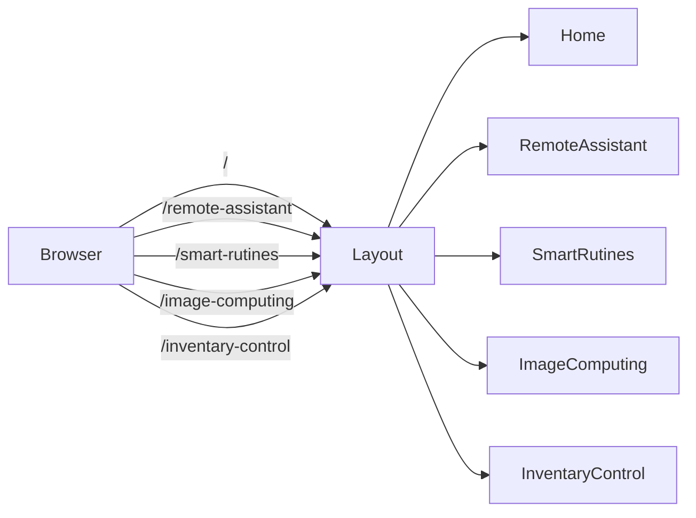

```json
[
  {
    "name": "Home",
    "file": "src/pages/Home.tsx",
    "paths": ["/", "/home"],
    "services": ["BannerService.getAllByPage('home')"],
    "components": ["MainBanner", "ContentStripe", "Swiper", "Fade", "Modal"],
    "interactions": ["show Modal", "navigate to ContactForm"]
  },
  {
    "name": "RemoteAssistant",
    "file": "src/pages/RemoteAssistant.tsx",
    "paths": ["/remote-assistant"],
    "services": ["BannerService.getAllByPage('remote-assistant')"],
    "components": ["MainBanner", "ContentStripe", "CardTransparent", "CarouselCollapse"],
    "interactions": ["link to ContactForm", "expand CarouselCollapse"]
  },
  {
    "name": "SmartRutines",
    "file": "src/pages/SmartRutines.tsx",
    "paths": ["/smart-rutines"],
    "services": ["BannerService.getAllByPage('smart-rutines')"],
    "components": ["MainBanner", "ContentStripe", "CardTransparent", "CarouselCollapse"],
    "interactions": ["animations with react-awesome-reveal"]
  },
  {
    "name": "ImageComputing",
    "file": "src/pages/ImageComputing.tsx",
    "paths": ["/image-computing"],
    "services": [],
    "components": ["MainBanner", "ContentStripe", "Card", "Fade"],
    "interactions": ["toggle description on click"]
  },
  {
    "name": "InventaryControl",
    "file": "src/pages/InventaryControl.tsx",
    "paths": ["/inventary-control"],
    "services": ["BannerService.getAllByPage('inventary-control')"],
    "components": ["MainBanner", "ContentStripe", "CardTransparent", "CarouselCollapse"],
    "interactions": ["navigate to ContactForm"]
  }
]
```



## Criterios de Aceptación
1. Cada página definida en el JSON existe en disco y exporta el componente con el mismo `name`.
2. Todos los `paths` están registrados en `src/router.tsx` y pasan pruebas de cobertura de rutas.
3. Los servicios referenciados existen en `src/services/` y cumplen su contrato de interfaz.
4. Los componentes listados se importan y renderizan correctamente en cada página.
5. Las interacciones (modales, animaciones, navegación) tienen tests E2E automatizados generados por el Test Agent.

[Code Agent]
"Usa el JSON anterior para generar o actualizar src/router.tsx, importar cada página en el layout y asegurar que las rutas funcionan correctamente."

[Test Agent]
"Genera tests automatizados que iteren sobre los paths del JSON y verifiquen respuesta HTTP 200 y renderizado del componente correspondiente."

[Doc Agent]
"Refina esta sección con ejemplos de uso y enlaces cruzados a components-selectors-mapping.md para cada componente usado."

# Páginas en `src/pages/`

Este documento resume la funcionalidad de cada página de la aplicación, la forma en que obtienen sus datos y las rutas configuradas en React Router.

## Home
- **Ruta del archivo:** `src/pages/Home.tsx`.
- **Path en React Router:** `/` y `/home`.
- **Datos consumidos:** usa `BannerService` para llamar a `getAllByPage('home')`, que obtiene banners y tarjetas de la carpeta `databaseInMemory`.
- **Componentes renderizados:** `MainBanner`, `ContentStripe` y un carrusel `Swiper` con tarjetas de productos. También se muestran componentes de soporte como `Fade`.
- **Llamadas a la API simulada:** la función `getBannerId` filtra los datos devueltos por el servicio para cada sección.
- **Interacciones:** un estado `show` abre un `<Modal>` con un video de YouTube al pulsar el botón «Ver Video». Los botones «Más información» llevan al formulario de contacto.

## RemoteAssistant
- **Ruta del archivo:** `src/pages/RemoteAssistant.tsx`.
- **Path en React Router:** `/remote-assistant`.
- **Datos consumidos:** llama a `bannerService.getAllByPage('remote-assistant')` para obtener banners, tarjetas y listados.
- **Componentes renderizados:** `MainBanner`, `ContentStripe`, `CardTransparent` y `CarouselCollapse` para las secciones de problemas, beneficios y pasos del servicio.
- **Llamadas a la API simulada:** `getBannerId` filtra los registros de `databaseInMemory/banner.ts` según `bannerId` y `page`.
- **Interacciones:** no mantiene estado local salvo los datos cargados. Los botones y tarjetas enlazan al formulario de contacto o despliegan información dentro de `CarouselCollapse`.

## SmartRutines
- **Ruta del archivo:** `src/pages/SmartRutines.tsx`.
- **Path en React Router:** `/smart-rutines`.
- **Datos consumidos:** obtiene información desde `bannerService.getAllByPage('smart-rutines')`.
- **Componentes renderizados:** `MainBanner`, `ContentStripe`, `CardTransparent` y `CarouselCollapse`, con estructura equivalente a la de *RemoteAssistant*.
- **Llamadas a la API simulada:** se filtra la base de datos en memoria con `getBannerId` para cargar cada sección.
- **Interacciones:** las tarjetas descriptivas y botones usan `react-awesome-reveal` para animaciones; no hay otro estado local.

## ImageComputing
- **Ruta del archivo:** `src/pages/ImageComputing.tsx`.
- **Path en React Router:** `/image-computing`.
- **Datos consumidos:** no hace peticiones al servicio; el contenido es estático y utiliza componentes `MainBanner` y `ContentStripe`.
- **Componentes renderizados:** tarjetas `Card` dentro de una sección «¿Cómo funciona?» y dos tarjetas plegables que se muestran al hacer clic.
- **Llamadas a la API simulada:** ninguna.
- **Interacciones:** un estado `open` controla qué tarjeta desplegar; los eventos `onClick` alternan la visibilidad de cada descripción con `Fade`.

## InventaryControl
- **Ruta del archivo:** `src/pages/InventaryControl.tsx`.
- **Path en React Router:** `/inventary-control`.
- **Datos consumidos:** extrae banners y tarjetas desde `bannerService.getAllByPage('inventary-control')`.
- **Componentes renderizados:** `MainBanner`, `ContentStripe`, `CardTransparent` y `CarouselCollapse` para explicar el servicio y sus beneficios.
- **Llamadas a la API simulada:** `getBannerId` filtra `databaseInMemory` por página e `id` de banner.
- **Interacciones:** los botones de cada tarjeta redirigen al formulario de contacto. No se gestiona otro estado aparte de la carga de datos.

## Índice de exportación
- **Ruta del archivo:** `src/pages/index.ts`.
- **Propósito:** reexporta todas las páginas y el layout principal para que el router pueda importarlos de forma centralizada.

Todas estas páginas se renderizan dentro del `Layout` definido en `src/pages/layouts/Layout.tsx` y se orquestan mediante `createBrowserRouter` en `src/router.tsx`.
