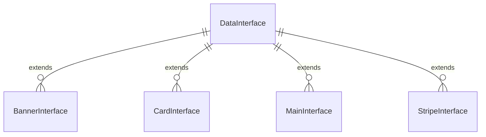

[
  {
    "file": "dataInterface.ts",
    "export": "default DataInterface",
    "path": "src/services/interface/dataInterface.ts",
    "fields": [
      { "name": "id",        "type": "number",   "required": true,  "description": "Identificador único" },
      { "name": "bannerId",  "type": "number",   "required": true,  "description": "ID de banner asociado" },
      { "name": "page",      "type": "string[]", "required": true,  "description": "Páginas donde aparece" }
    ],
    "extends": [],
    "examples": [
      "{ id: 1, bannerId: 0, page: ['home'] }"
    ]
  },
  {
    "file": "bannerInterface.ts",
    "export": "default BannerInterface",
    "path": "src/services/interface/bannerInterface.ts",
    "fields": [
      { "name": "id",   "type": "number",           "required": true,  "description": "ID del banner" },
      { "name": "pos",  "type": "number",           "required": false, "description": "Posición opcional" },
      { "name": "data", "type": "DataInterface[]",  "required": true,  "description": "Datos asociados" }
    ],
    "extends": [],
    "examples": [
      "{ id: 2, data: [{ id: 1, bannerId: 2, page: ['home'] }] }"
    ]
  },
  {
    "file": "cardInterface.ts",
    "export": "default CardInterface",
    "path": "src/services/interface/cardInterface.ts",
    "fields": [
      { "name": "number",      "type": "string", "required": false },
      { "name": "heading",     "type": "string", "required": false },
      { "name": "image",       "type": "string", "required": false },
      { "name": "title",       "type": "string", "required": false },
      { "name": "text",        "type": "string", "required": false },
      { "name": "description", "type": "string", "required": false }
    ],
    "extends": ["DataInterface"],
    "examples": [
      "{ id:3, bannerId:2, page:['home'], image:'url', description:'text' }"
    ]
  },
  {
    "file": "mainInterface.ts",
    "export": "default MainInterface",
    "path": "src/services/interface/mainInterface.ts",
    "fields": [
      { "name": "image",      "type": "string",  "required": false },
      { "name": "buttonBack", "type": "boolean", "required": false },
      { "name": "subHeading", "type": "string",  "required": false },
      { "name": "heading",    "type": "string",  "required": false },
      { "name": "text",       "type": "string",  "required": false }
    ],
    "extends": ["DataInterface"],
    "examples": [
      "{ id:10, bannerId:1, page:['home'], image:'banner.jpg', heading:'Hi', text:'desc' }"
    ]
  },
  {
    "file": "stripeInterface.ts",
    "export": "default StripeInterface",
    "path": "src/services/interface/stripeInterface.ts",
    "fields": [
      { "name": "image",         "type": "string",  "required": false },
      { "name": "title",         "type": "string",  "required": false },
      { "name": "text",          "type": "string",  "required": false },
      { "name": "buttonText",    "type": "string",  "required": false },
      { "name": "buttonUrl",     "type": "string",  "required": false },
      { "name": "buttonPathIcon","type": "string",  "required": false },
      { "name": "imageRight",    "type": "boolean", "required": false }
    ],
    "extends": ["DataInterface"],
    "examples": [
      "{ id:20, bannerId:3, page:['about'], title:'t', text:'', imageRight:true }"
    ]
  }
]

## Criterios de Aceptación
1. Cada archivo listado en el JSON existe en `src/services/interface/` y exporta la interfaz correcta.  
2. Los campos (`fields`) coinciden al 100 % con las definiciones TypeScript.  
3. Las relaciones de herencia (`extends`) se reflejan en el código real (uso de `extends`).  
4. Los ejemplos JSON son válidos y parseables para tests de tipado.  
5. El Test Agent puede generar tests de validación dinámica basados en este JSON.

[Code Agent]

"Usa el JSON de interfaces para generar automáticamente src/services/interface/index.ts que reexporte todas las interfaces y actualizar importaciones rotas en el proyecto."

[Test Agent]

"Genera tests en Jest o Vitest que importen cada interfaz, validen un ejemplo de JSON contra el tipo y fallen si no coincide."

[Doc Agent]

"Refina la documentación narrativa usando el JSON, añade enlaces a ejemplos de uso en los servicios (bannerService.ts, etc.) y actualiza anclas."
