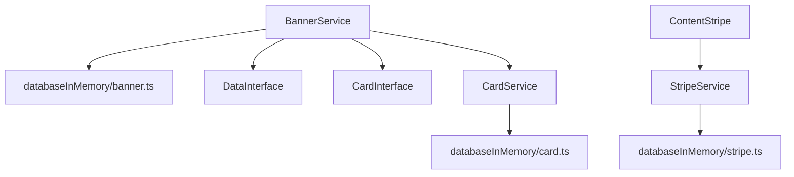

```json
[
  {
    "name": "BannerService",
    "file": "src/services/bannerService.ts",
    "methods": [
      { "name": "getAll",             "signature": "(): Promise<BannerInterface[] | null>" },
      { "name": "getAllById",         "signature": "(bannerId: number): Promise<BannerInterface[] | null>" },
      { "name": "getSpecificCard",    "signature": "(bannerId: number, cardId: number): Promise<DataInterface | null>" },
      { "name": "getAllByIdAndPage",  "signature": "(bannerId: number, page: string): Promise<DataInterface[] | null>" },
      { "name": "getAllByPage",       "signature": "(page: string): Promise<BannerInterface[] | null>" }
    ],
    "dependencies": ["databaseInMemory/banner.ts", "DataInterface", "CardInterface"],
    "consumers": ["Home.tsx", "RemoteAssistant.tsx"],
    "notes": ["Filtro y mapeo sobre BANNERS", "Podría refactorizarse a fetch HTTP"]
  },
  {
    "name": "CardService",
    "file": "src/services/cardService.ts",
    "methods": [
      { "name": "getAll",             "signature": "(): Promise<CardInterface[] | null>" }
    ],
    "dependencies": ["databaseInMemory/card.ts"],
    "consumers": ["BannerService", "CarouselCollapse.tsx"],
    "notes": ["Uso indirecto vía BannerService"]
  },
  {
    "name": "StripeService",
    "file": "src/services/stripeService.ts",
    "methods": [
      { "name": "getAll",             "signature": "(): Promise<StripeInterface[] | null>" }
    ],
    "dependencies": ["databaseInMemory/stripe.ts"],
    "consumers": ["ContentStripe.tsx"],
    "notes": ["Preparado para filtrado futuro por página"]
  }
]
```



## Criterios de Aceptación
1. Cada servicio listado en el JSON existe en la ruta `file` y exporta los métodos con las firmas indicadas.
2. Las entradas de `dependencies` apuntan a ficheros o interfaces que existen y están correctamente tipados.
3. Los componentes en `consumers` importan el servicio y lo usan sin errores de compilación.
4. El Code Agent puede refactorizar un servicio InMemory a uno que haga fetch HTTP manteniendo la misma interfaz.
5. El Test Agent genera tests unitarios que simulen las dependencias InMemory y validen la lógica de filtrado/mapeo.

[Code Agent]

"Usa el JSON para refactorizar bannerService.ts a un cliente HTTP que llame a /api/banners, manteniendo la misma interfaz de métodos."

[Test Agent]

"Genera tests en Jest que:

Mockeen fetch y devuelvan datos de ejemplo.

Verifiquen que getAllByPage('home') filtra correctamente."

[Doc Agent]

"Actualiza src-services-interface.md y este archivo para documentar los nuevos endpoints y ejemplos de uso."

