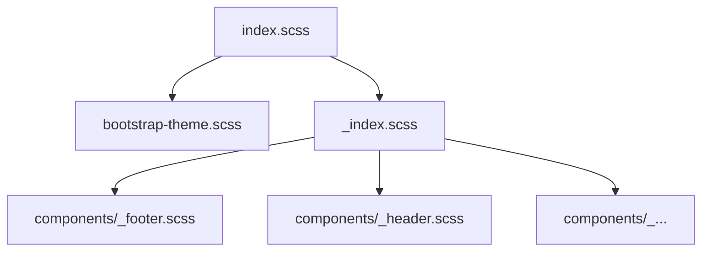

Bloque JSON machine-readable
```json
[
  {
    "file": "src/index.scss",
    "role": "entry",
    "imports": ["styles/bootstrap-theme", "styles/index"],
    "defines": ["@font-face", "base styles", "utilities"],
    "notes": ["punto de entrada global"]
  },
  {
    "file": "src/styles/bootstrap-theme.scss",
    "role": "theme",
    "variables": ["$primary", "$secondary"],
    "forwards": ["vendor/bootstrap/bootstrap"],
    "notes": ["personaliza Bootstrap antes de compilar"]
  },
  {
    "file": "src/styles/_index.scss",
    "role": "aggregator",
    "imports": [
      "components/footer",
      "components/header",
      "components/content__stripe",
      "components/main__banner",
      "components/card__transparent",
      "components/carousel__collapse",
      "components/button__top"
    ],
    "defines": ["layout classes", "media queries"],
    "notes": ["agrupa parciales de componentes"]
  },
  {
    "dir": "src/styles/components",
    "role": "partials",
    "entries": [
      "_footer.scss",
      "_header.scss",
      "_content__stripe.scss",
      "_main__banner.scss",
      "_card__transparent.scss",
      "_carousel__collapse.scss",
      "_button__top.scss"
    ],
    "notes": ["estilos específicos por componente"]
  },
  {
    "dir": "src/styles/vendor/bootstrap",
    "role": "bootstrap_vendor",
    "generated": true,
    "notes": ["no versionado, creado con bootstrap:migrate"]
  }
]
```



[Code Agent]
"Usa el JSON de src-styles.md para crear un script Node.js que valide la estructura de src/styles/ y que genere un índice de variables SASS (styles/variables.json)."

[Design Agent]
"Genera un documento de referencia exportando cada $variable y @mixin definido en los SCSS como un JSON con nombre, valor y archivo de origen."

[Test Agent]
"Crea tests que validen que el CSS final (tras build) contiene todas las clases listadas en los parciales y no hay clases huérfanas."

## Criterios de Aceptación
1. El JSON refleja todos los archivos y directorios dentro de `src/styles/`.
2. Cada ruta existe en disco y su `role` coincide con el uso real.
3. El Code Agent puede generar un script (`scripts/check-styles.js`) que recorra este JSON y falle si falta algún SCSS.
4. El Design Agent puede extraer variables y mixins del JSON para generar documentación de estilos automática.
5. El Test Agent genera tests que comprueben que el bundle CSS final incluye todas las clases definidas en los parciales y que no hay clases huérfanas.
